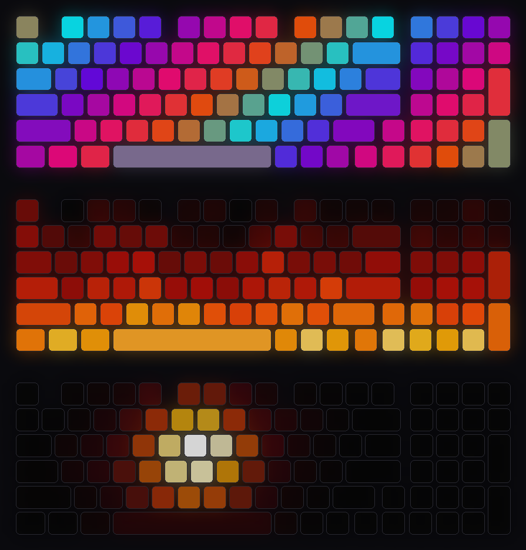

<div align="center">

# kreo

**Your Kreo Hive 98, fully alive on Linux.**

Hardware lighting · per-key RGB · live animations · music visualizer · Hyprland keybind HUD

[](https://kreo-hive98.vercel.app)




</div>

---

`kreo` drives the Kreo Hive 98 (EVision controller, USB `320F:5055`) straight over `hidraw`.
There's no vendor app, no daemon you have to trust, and no dependencies beyond Python 3.9.
Every setting it writes to the keyboard is read back to confirm it, and it never writes the keymap.

## Features

| | |
|---|---|
| **Hardware lighting** | All built-in modes (wave, ripple, reactive, breathing, …), color, brightness, speed, three onboard profiles. Stored on the keyboard, works without the PC. |
| **Per-key RGB** | Color single keys or zones (`wasd`, `arrows`, `numpad`, …) and keep them on the keyboard. |
| **Live animations** | `fire` `aurora` `matrix` `supernova` `ripple` `rain` `scanner` `chroma` `perimeter` `heartbeat` `reactive`, streamed at up to 45 fps. |
| **Music visualizer** | Spectrum bars, bass pulse or wave across all 98 keys, fed by [cava](https://github.com/karlstav/cava) from PipeWire/PulseAudio. |
| **Hyprland HUD** | Hold Super/Alt/Ctrl/Shift and every key bound to that combination lights up, colored by what it does. Workspaces on the number row, CPU/RAM/battery/volume on the numpad. |
| **Write your own** | An animation is a ~15-line Python class dropped into `~/.config/kreo/effects/`. |

## Install

```bash
git clone https://github.com/omsingh02/kreo && cd kreo

# let your user talk to the keyboard (no root needed afterwards)
sudo install -m 0644 udev/71-kreo-hive98.rules /etc/udev/rules.d/
sudo udevadm control --reload && sudo udevadm trigger --subsystem-match=hidraw

pipx install --editable .
```

The keyboard has to be connected by cable. Optional extras: `cava` for the visualizer and
`python-dbus` to show the Kreo Pegasus mouse battery in `kreo status`.

## Usage

```bash
kreo                                   # interactive menu
kreo status                            # the three onboard profiles
kreo modes                             # list hardware modes
```

**Stored on the keyboard**

```bash
kreo set -m ripple -c "#00F0FF" -s 1   # mode, color, speed (0 fast … 5 slow)
kreo set -b 2 --rainbow                # brightness 0-4, color cycling
kreo set -t                            # pywal accent color
kreo set -m wave --preview 5           # try for 5 s, then restore
kreo on | off | toggle
kreo profile 2                         # switch profile
kreo custom zone wasd cyan --apply     # per-key colors (+ switch to mode "custom")
kreo custom set ESC F12 red            # single keys; see `kreo map` for names
kreo custom show                       # draw the stored per-key colors
kreo backup / kreo restore FILE        # save and restore profiles + per-key colors
```

**Streamed live (Ctrl+C to stop; the keyboard returns to its profile)**

```bash
kreo anim --list
kreo anim fire --speed 1.5
kreo viz -m pulse -s fire              # bars | pulse | wave, theme | vu | fire | ice | rainbow
kreo hud                               # Hyprland keybind HUD
```

Only one stream can run at a time, and profile changes are refused while one runs.

## Hyprland HUD

`kreo hud` reads your binds live from `hyprctl binds`, so it always matches your config.

- **Hold a modifier:** keys bound to that combination light up. Cyan launches, amber moves windows and workspaces, green is media/volume, red kills/exits, violet enters a submap.
- **Number row:** workspaces. Cyan is active, white has windows, slate is empty.
- **Numpad:** CPU, RAM, battery and volume gauges (`--no-gauges` to switch off, `--base theme` adds a dim backlight).

Run it at login:

```bash
systemctl --user link $PWD/systemd/kreo.service
systemctl --user enable --now kreo.service
```

## Write an animation

The file name is the command name: `~/.config/kreo/effects/sweep.py` → `kreo anim sweep`.

```python
from kreo import Effect, EffectContext, Layout, Color, GradientPalette

class Sweep(Effect):
    title = "Sweep"
    cycle_duration = 4.0

    def setup(self, layout: Layout):
        self.palette = GradientPalette([(0.0, Color.from_hex("#00FFFF")), (1.0, Color.from_hex("#FF00FF"))])

    def render(self, ctx: EffectContext):
        for key in ctx.keys:
            ctx.canvas.set_pixel(key.slot, self.palette.sample((key.cx / ctx.width + ctx.cycle_progress) % 1.0))
```

- `Color(r, g, b)` takes 0-1 floats and `Color.rgb()` takes 0-255.
- Key positions are in key units; the board is 19.25 × 6.
- Set `uses_input = True` to get `ctx.key_events` and `ctx.held_keys`, read straight from the keyboard with no focus required.

## How it works

The Hive 98 exposes vendor report `0x04` on USB interface 1. Every packet is 64 bytes:
`[0x04, checksum lo, checksum hi, cmd, size, offset lo, offset hi, 0, data…]`, where the checksum is the 16-bit sum of bytes 3-63.

| cmd | |
|---|---|
| `0x01` / `0x02` | begin / end config write |
| `0x05` / `0x06` | read / write config: byte 0 is the active profile, profiles start at `0x01` `0x41` `0x81`, the keymap follows from `0xC0` |
| `0x0A` / `0x0B` | read / write per-key colors (128 slots × RGB, slot = matrix column × 8 + row) |
| `0x12` / `0x13` | stream a live frame (RAM only, 7 packets ≈ 20 ms) / return to the stored profile |

Keystrokes for reactive effects and the HUD come from interface 0 (boot reports) and the NKRO
bitmap (report `0x01`) on interface 1.

## Notes

- Only tested on the wired Hive 98. Other EVision boards may work with a different layout table (`kreo/layout.py`).
- `kreo restore` only accepts files from `kreo backup`.
- Not affiliated with Kreo.

MIT © 2026 faulter
